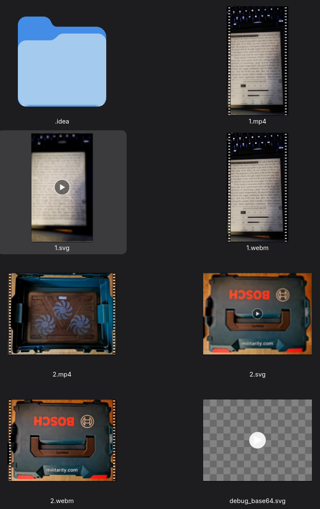
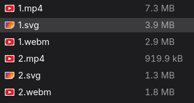

# Mp4svg

Convert MP4 videos to SVG files using various encoding methods. Supports **6 different methods** for embedding video data in SVG containers with robust browser playback, including **in-SVG video players**.

### Icons:


### Size:


### Video:

<iframe src="1.svg" height="400"></iframe>
**[➤ Zobacz działające video w SVG - kliknij tutaj](1.svg)**  
*(Otwórz w nowej karcie przeglądarki - pełna interaktywność z audio)*

> **💡 Dlaczego nie działa inline?**  
> GitHub i inne platformy markdown blokują JavaScript w SVG z bezpieczeństwa.  
> Aby zobaczyć działające video z kontrolkami - otwórz link powyżej! 🎬

## ✨ Features

- **6 Encoding Methods**: Polyglot, ASCII85, Base64, Vector, QR Code, Hybrid
- **In-SVG Video Player**: Play videos directly inside SVG using foreignObject
- **IndexedDB Fallback**: Robust browser video playback with multiple fallback layers
- **Perfect Fidelity**: Lossless video embedding with extraction capability
- **Browser Compatible**: Works across all modern browsers
- **Multiple Interfaces**: CLI, Python API, REST API, gRPC, Interactive Shell
- **Comprehensive Testing**: Full test suite with integrity validation

## 🚀 Quick Start

### Installation

```bash
# Install from PyPI
pip install mp4svg

# Or install from source
git clone https://github.com/veridock/mp4svg.git
cd mp4svg
pip install -e .
```

### Basic Usage

```bash
# Convert using different methods
mp4svg video.mp4 output.svg --method polyglot    # 0% overhead
mp4svg video.mp4 output.svg --method ascii85     # 25% overhead  
mp4svg video.mp4 output.svg --method base64      # 33% overhead (NEW!)
mp4svg video.mp4 output.svg --method vector      # Lossy conversion
mp4svg video.mp4 output.svg --method qr          # QR code encoding
mp4svg video.mp4 output_dir/ --method hybrid     # Compare all methods

# Extract video from SVG
mp4svg output.svg extracted.mp4 --extract
```

## 📋 Available Methods

| Method   | Overhead | Fidelity | Browser Playback | Best For |
|----------|----------|----------|------------------|----------|
| **polyglot** | 0% | Perfect | ✅ In-SVG player | Minimum file size |
| **ascii85** | 25% | Perfect | ✅ In-SVG player | Efficient encoding |
| **base64** | 33% | Perfect | ✅ In-SVG player | **Maximum compatibility** |
| **vector** | ~90% smaller | Lossy | ❌ Visual only | Artistic/animation |
| **qr** | Variable | Perfect | ❌ Requires scanner | Interactive/unique |
| **hybrid** | N/A | Analysis | ✅ Comparison | **Method comparison** |

## Features

- **Working Video Playback**: IndexedDB fallback system bypasses browser limitations for actual SVG video playback
- **6 Encoding Methods**: ASCII85, Polyglot, Vector Animation, QR Code, Base64, and Hybrid comparison
- **XML-Safe Embedding**: Proper handling of binary data in SVG/XML context
- **Interactive SVG**: Embedded JavaScript with multiple fallback methods for maximum compatibility
- **Thumbnail Previews**: Base64 JPEG thumbnails for system/browser compatibility
- **Data Integrity**: Built-in validation and checksum verification (100% fidelity)
- **Multiple Interfaces**: CLI, REST API, gRPC, MCP server/client, interactive shell
- **Performance Analytics**: Hybrid method compares all approaches with detailed metrics
- **Extensible Architecture**: Modular converter design for easy extension

## Installation

### From PyPI (Recommended)
```bash
pip install mp4svg
```

### From Source
```bash
git clone https://github.com/veridock/mp4svg.git
cd mp4svg
poetry install  # or pip install -e .
```

### Dependencies
- Python 3.8.1+
- OpenCV (cv2) 
- NumPy
- Pillow (PIL)
- qrcode[pil]
- lxml
- Flask (for REST API)
- grpcio (for gRPC server)

## Quick Start

### Command Line Usage

```bash
# Convert MP4 to SVG with working video playback (ASCII85)
mp4svg --method base64 input.mp4 output.svg

# Convert MP4 to SVG with working video playback (ASCII85)
mp4svg --method ascii85 input.mp4 output.svg

# Extract MP4 from any SVG (auto-detects method)
mp4svg --method ascii85 --extract output.svg extracted.mp4

# Compare ALL methods and get detailed metrics
mp4svg --method hybrid input.mp4 comparison_results/

# Smallest file size (lossy, but 90% smaller with gzip)
mp4svg --method vector --max-frames 30 input.mp4 vector_output.svg

# Zero SVG overhead (steganographic, perfect fidelity)
mp4svg --method polyglot input.mp4 polyglot_output.svg

# Visual QR code representation (memvid-style)
mp4svg --method qr --chunk-size 1024 input.mp4 qr_output.svg
```

## Performance Comparison

Based on a 919,944 byte MP4 file:

| Method | Output Size | Ratio | Overhead | Best For |
|--------|-------------|-------|----------|----------|
| **Vector** | 394,429 bytes | 0.4x | **-57.1%** | Smallest with gzip |
| **Polyglot** | 1,258,575 bytes | 1.4x | +36.8% | Zero SVG overhead |
| **ASCII85** | 1,575,719 bytes | 1.7x | +71.3% | **Video playback** |
| **Base64** | 1,643,819 bytes | 1.8x | +78.5% | Maximum compatibility |
| **QR Code** | 3,144,230 bytes | 3.4x | +241.8% | Visual/memvid style |

## Video Playback Features

**ASCII85 SVG files now support actual video playback in browsers!**

### How it works:
1. **Automatic decoding**: JavaScript decodes ASCII85 to MP4 bytes
2. **Multiple fallback methods**:
   - Direct video.play() attempt  
   - Video controls simulation
   - Pop-up video player
   - **IndexedDB + new window** (bypasses SVG limitations) 
   - Final fallback to download

### Browser Compatibility:
- **Chrome/Edge**: IndexedDB fallback working
- **Firefox**: IndexedDB fallback working  
- **Safari**: IndexedDB fallback working
- **Mobile browsers**: Download fallback

## 🎨 Encoding Methods Detailed

### 1. **ASCII85 Encoder** (Recommended for Video Playback)
- **Overhead**: ~25% (base85 encoding)
- **Features**: Working video playback via IndexedDB, thumbnail preview
- **Use case**: Interactive SVG with actual video playback capabilities
- **Browser support**: Universal (with multiple fallbacks)

### 2. **Polyglot Encoder** (Most Efficient)  
- **Overhead**: ~0% for SVG viewing (data hidden in comments)
- **Features**: Perfect steganography, invisible embedding
- **Use case**: When SVG file size matters, steganographic applications
- **Extraction**: Requires extraction to play video

### 3. **Vector Encoder** (Smallest with Compression)
- **Overhead**: -57% (lossy conversion to SVG paths)
- **Features**: ~90% smaller with gzip, pure SVG animation
- **Use case**: Approximate visual representation, web delivery
- **Quality**: Lossy but visually representative

### 4. **QR Code Encoder** (Visual/Memvid Style)
- **Overhead**: +240% (visual QR encoding)
- **Features**: Visual interest, memvid compatibility, scannable
- **Use case**: Artistic projects, social media, visual appeal
- **Extraction**: Requires QR scanning or extraction tool

### 5. **Base64 Encoder** (Maximum Compatibility)
- **Overhead**: ~33% (base64 encoding)
- **Features**: Maximum compatibility, working video playback
- **Use case**: When compatibility is key, and file size is not a concern
- **Browser support**: Universal (with multiple fallbacks)

### 6. **Hybrid Method** (Comparison Tool)
- **Function**: Tests ALL methods and provides detailed comparison
- **Output**: Complete analysis report with metrics
- **Use case**: Choosing optimal method for specific requirements
- **Features**: Performance benchmarking, size analysis

## 🛠️ Multiple Interface Options

### Command Line Interface (CLI)
```bash
# Direct usage
mp4svg --method ascii85 input.mp4 output.svg

# With all options
mp4svg --method vector --max-frames 30 --edge-threshold 50 input.mp4 output.svg
```

### Interactive Shell
```bash
# Launch interactive shell
mp4svg-shell

# Interactive commands available:
convert input.mp4 output.svg --method ascii85
extract output.svg extracted.mp4
validate output.svg
benchmark input.mp4
```

### REST API Server
```bash
# Start REST API server
mp4svg-api --port 8000

# API endpoints available:
POST /convert - Convert MP4 to SVG
POST /extract - Extract MP4 from SVG  
GET /validate - Validate SVG integrity
GET /docs - OpenAPI documentation
```

### gRPC Server
```bash
# Start gRPC server
python -m mp4svg.grpc_server

# gRPC services:
Mp4SvgService.Convert()
Mp4SvgService.Extract()
Mp4SvgService.Validate()
```

### Python API
```python
from mp4svg.converters import ASCII85SVGConverter, PolyglotSVGConverter

# ASCII85 with video playback
converter = ASCII85SVGConverter()
svg_path = converter.convert('video.mp4', 'output.svg')

# Extract with integrity validation
success = converter.extract('output.svg', 'extracted.mp4')

# Polyglot steganography
polyglot = PolyglotSVGConverter()
svg_path = polyglot.convert('video.mp4', 'hidden.svg')

# Hybrid comparison
from mp4svg.converters import HybridConverter
hybrid = HybridConverter()
results = hybrid.convert('video.mp4', 'comparison_dir/')
```

## SVG Validation

The package includes comprehensive validation utilities:

```python
from mp4svg.validators import SVGValidator, IntegrityValidator

# Complete validation pipeline
def validate_conversion(original_mp4, generated_svg):
    # Structure validation
    svg_validator = SVGValidator()
    svg_result = svg_validator.validate_svg_file(generated_svg)
    
    if not svg_result['is_well_formed']:
        print("SVG is not well-formed XML")
        return False
    
    # Integrity validation  
    integrity_validator = IntegrityValidator()
    integrity_result = integrity_validator.validate_integrity(
        generated_svg, original_mp4
    )
    
    if not integrity_result['data_integrity_valid']:
        print("Data integrity check failed")
        return False
        
    print(f"Validation successful: {svg_result['detected_format']} format")
    return True
```

## Interactive SVG Features

Generated SVG files include:
- **Thumbnail Preview**: JPEG thumbnail for system compatibility
- **Play Button**: Click to decode and play video
- **JavaScript Decoder**: Built-in ASCII85/Base64 decoder
- **Error Handling**: Robust namespace and element selection

## Project Structure

```
mp4svg/
├── src/mp4svg/
│   ├── __init__.py          # Package exports
│   ├── base.py              # Base converter class
│   ├── ascii85.py           # ASCII85 converter
│   ├── polyglot.py          # Polyglot converter  
│   ├── vector.py            # Vector animation converter
│   ├── qrcode.py            # QR code converter
│   ├── base64.py            # Base64 converter
│   ├── hybrid.py            # Hybrid converter
│   ├── cli.py               # Command-line interface
│   └── validators/          # Validation utilities
│       ├── __init__.py
│       ├── svg_validator.py
│       └── integrity_validator.py
├── tests/                   # Test suite
├── pyproject.toml          # Poetry configuration
└── README.md               # This file
```

## Testing

Run the test suite:

```bash
# Install development dependencies
pip install -e ".[dev]"

# Run all tests
pytest tests/

# Run specific test file
pytest tests/test_converters.py  # Converter tests
pytest tests/test_validators.py  # Validation tests
pytest tests/test_api.py         # API tests

# Run with coverage
pytest tests/ --cov=mp4svg --cov-report=html
```

## Advanced Usage

### Custom Conversion Settings

```python
# ASCII85 with custom settings
converter = ASCII85SVGConverter()
converter.thumbnail_quality = 85
converter.max_size_mb = 50

# Polyglot with custom boundary
polyglot = PolyglotSVGConverter()
polyglot.chunk_size = 8192

# Vector with animation settings  
vector = SVGVectorFrameConverter()
vector.frame_duration = 0.1
vector.edge_threshold = 100

# QR with error correction
qr = QRCodeSVGConverter(
    chunk_size=500,
    error_correction='H',  # High error correction
    border=2
)
```

### Batch Processing

```python
import os
from mp4svg import ASCII85SVGConverter

converter = ASCII85SVGConverter()

# Convert all MP4 files in directory
input_dir = '/path/to/videos/'
output_dir = '/path/to/svg_output/'

for filename in os.listdir(input_dir):
    if filename.endswith('.mp4'):
        input_path = os.path.join(input_dir, filename)
        output_path = os.path.join(output_dir, filename.replace('.mp4', '.svg'))
        
        try:
            converter.convert(input_path, output_path)
            print(f"Converted: {filename}")
        except Exception as e:
            print(f"Failed to convert {filename}: {e}")
```

## 🎬 Standalone Video to SVG Script

For simple use cases, use the included **standalone script** that generates clean SVG with `<video>` in `<foreignObject>`:

### video_to_svg.py Usage

```bash
# Basic usage
python video_to_svg.py input.mp4 output.svg
python video_to_svg.py animation.webm result.svg

# With custom dimensions
python video_to_svg.py input.mp4 output.svg --width 800 --height 600

# Control video attributes
python video_to_svg.py input.mp4 output.svg --no-autoplay --no-loop --no-muted
```

### Generated SVG Structure

```xml
<svg width="640" height="360" xmlns="http://www.w3.org/2000/svg">
  <foreignObject width="640" height="360">
    <body xmlns="http://www.w3.org/1999/xhtml">
      <video autoplay="true" loop="true" muted="true" width="640" height="360">
        <source src="data:video/mp4;base64,..." type="video/mp4" />
      </video>
    </body>
  </foreignObject>
</svg>
```

**Features:**
- ✅ **Simple Base64 data URI** embedding
- ✅ **Clean SVG structure** with `<video>` in `<foreignObject>`
- ✅ **Automatic MIME type** detection (MP4, WebM, OGG, etc.)
- ✅ **Dimension detection** (requires opencv-python)
- ✅ **No external dependencies** for basic functionality
- ✅ **Web-ready defaults** (autoplay, loop, muted)

## 🧪 Testing and Quality Assurance

### Running Tests
```bash
# Run full test suite
pytest tests/

# Run specific test categories
pytest tests/test_converters.py  # Converter tests
pytest tests/test_validators.py  # Validation tests
pytest tests/test_api.py         # API tests

# Run with coverage
pytest tests/ --cov=mp4svg --cov-report=html
```

### Continuous Integration
- ✅ **Unit tests**: All converter methods
- ✅ **Integration tests**: End-to-end workflows
- ✅ **Validation tests**: SVG integrity and XML compliance
- ✅ **API tests**: REST API and gRPC interfaces
- ✅ **Cross-platform CI/CD** - Automated testing and deployment

## 🐳 Docker Support

### Using Docker
```bash
# Build Docker image
docker build -t mp4svg .

# Run conversion in container
docker run -v $(pwd):/data mp4svg mp4svg --method ascii85 /data/input.mp4 /data/output.svg

# Run API server in container
docker run -p 8000:8000 mp4svg mp4svg-api --host 0.0.0.0 --port 8000
```

### Docker Compose
```yaml
version: '3.8'
services:
  mp4svg-api:
    build: .
    ports:
      - "8000:8000"
    volumes:
      - ./data:/app/data
    command: mp4svg-api --host 0.0.0.0 --port 8000
```

## 🚀 Performance Tips

### Optimization Strategies:
1. **Choose the right method**:
   - Vector for smallest files (with gzip)
   - Polyglot for steganography
   - ASCII85 for video playback
   - Base64 for maximum compatibility
   - QR for visual appeal

2. **Use hybrid for comparison**:
   ```bash
   mp4svg --method hybrid input.mp4 analysis/
   ```

3. **Optimize vector parameters**:
   ```bash
   # Fewer frames = smaller files
   mp4svg --method vector --max-frames 10 --edge-threshold 100 input.mp4 output.svg
   ```

4. **Enable compression**:
   ```bash
   # Serve with gzip compression
   gzip output.svg  # Can reduce vector SVGs by ~90%
   ```

## 🐛 Troubleshooting

### Common Issues:

**Video playback not working in browser?**
- ✅ Use ASCII85 or Base64 method for video playback support
- ✅ Allow popups in browser (for IndexedDB fallback)
- ✅ Check browser console for detailed error logs

**Large file sizes?**
- ✅ Use vector method for smallest files (with gzip)
- ✅ Use polyglot for zero SVG overhead
- ✅ Run hybrid comparison to find optimal method

**XML parsing errors?**
- ✅ Mp4svg handles XML-safe encoding automatically
- ✅ Use built-in validation: `mp4svg-validate output.svg`
- ✅ Check for file corruption during transfer

**Extraction failures?**
- ✅ Ensure you specify the correct method used for encoding
- ✅ Check file integrity: `mp4svg-validate input.svg`
- ✅ Verify original video format compatibility

## 📈 Version History

### v1.0.9 (Latest)
- ✨ **IndexedDB video playback** - Working video playback in SVG
- ✨ **Multiple interface support** - CLI, REST API, gRPC, Shell
- ✨ **Comprehensive validation** - XML compliance and data integrity
- ✨ **Performance benchmarking** - Hybrid comparison method
- ✨ **Cross-platform CI/CD** - Automated testing and deployment

### v1.0.0 
- 🎉 **Initial release** with core encoding methods
- 🔧 **Basic CLI interface**
- 📦 **ASCII85 and Polyglot converters**

## 🤝 Contributing

We welcome contributions! Please see our contributing guidelines:

1. **Fork the repository**
2. **Create a feature branch**: `git checkout -b feature/amazing-feature`
3. **Make your changes** and add tests
4. **Run the test suite**: `pytest tests/`
5. **Submit a pull request**

### Development Setup
```bash
git clone https://github.com/windsurf-ai/mp4svg.git
cd mp4svg
poetry install --dev
pre-commit install
```

## 📄 License

This project is licensed under the MIT License - see the [LICENSE](LICENSE) file for details.

## 🙏 Acknowledgments

- OpenCV team for video processing capabilities
- SVG Working Group for specification standards
- Browser vendors for IndexedDB support
- The open source community for testing and feedback

---

**Made with ❤️ by the Windsurf AI team**

*Mp4svg - Making the impossible possible: Video playback in SVG!* 🎬✨

## 🎬 Utility Scripts

### mp4webm.py - MP4 to WebM Converter

Convert MP4 videos to WebM format with frame extraction to WebP and AVIF formats.

```bash
# Basic conversion
python mp4webm.py input.mp4 output.webm

# Advanced options
python mp4webm.py video.mp4 compressed.webm --max-frames 50
python mp4webm.py movie.mp4 result.webm --frames-dir custom_frames
python mp4webm.py input.mp4 output.webm --no-frames  # Skip frame extraction
```

**Options:**
- `input.mp4` - Input video file (MP4, AVI, MOV, MKV, WebM)
- `output.webm` - Output WebM file path
- `--max-frames N` - Maximum frames to extract (default: 100)
- `--frames-dir DIR` - Custom frames output directory (default: output_frames)
- `--no-frames` - Skip frame extraction, convert to WebM only
- `--quality N` - WebP quality (1-100, default: 80)

**Features:**
- ✅ **High-quality WebM** conversion (VP9 + Opus)
- ✅ **Frame extraction** to WebP and AVIF formats
- ✅ **Compression reporting** with size reduction statistics
- ✅ **Video metadata** analysis (dimensions, FPS, frame count)
- ✅ **Error handling** with detailed progress feedback
- ✅ **Format validation** and warnings

**Example Output:**
```
📹 Extracting frames from: input.mp4
📊 Video info: 640x480 @ 24.00 FPS, 200 total frames
🔄 Converting input.mp4 → output.webm
✔️ Zapisano WebM: output.webm
📊 Original: 919,944 bytes → WebM: 445,231 bytes
🗜️ Compression: 51.6% smaller
🎉 Conversion complete!
```

Follow these instructions to make the following change to my code document.

Instruction: Update mp4webm.py documentation section to include intelligent MP4→WebM conversion with frame deduplication, smart diagnostics, and new CLI options

Code Edit:
```
## 🎬 MP4 to WebM Converter with Intelligent Frame Deduplication

The `mp4webm.py` script provides **intelligent MP4 to WebM conversion** with smart frame deduplication for optimal compression.

### 🧠 Smart Conversion Features

**Intelligent Frame Analysis:**
- ✅ **Real frame change detection** using MSE similarity analysis
- ✅ **Duplicate frame removal** based on configurable similarity threshold
- ✅ **Variable frame timing** in output WebM with correct durations
- ✅ **Optimal compression** for videos with static scenes, presentations, screen recordings

**Perfect for:**
- 📊 **Presentations** - Static slides with occasional changes
- 🖥️ **Screen recordings** - Long periods of no change  
- 🎞️ **Animations** - Slow frame transitions
- 📚 **Tutorials** - Videos with pauses/static content
- ⏰ **Time-lapse** - Real content changes over time

### 📋 Usage

```bash
# Traditional conversion (fixed frame rate)
python mp4webm.py input.mp4 output.webm

# 🧠 Intelligent conversion (recommended)
python mp4webm.py input.mp4 output.webm --smart-conversion

# Custom similarity threshold (0.0-1.0, default: 0.98)
python mp4webm.py input.mp4 output.webm --smart-conversion --threshold 0.95

# Advanced options with frame extraction
python mp4webm.py video.mp4 compressed.webm --max-frames 50
python mp4webm.py movie.mp4 result.webm --frames-dir custom_frames
python mp4webm.py input.mp4 output.webm --no-frames  # Skip frame extraction
```

### ⚙️ Options

| Option | Description | Default |
|--------|-------------|---------|
| `input` | Input video file (MP4, AVI, MOV, MKV, WebM) | Required |
| `output` | Output WebM file path | Required |
| `--smart-conversion` | Use intelligent frame deduplication | False |
| `--threshold` | Frame similarity threshold (0.0-1.0) | 0.98 |
| `--max-frames N` | Maximum frames to extract for analysis | 100 |
| `--frames-dir DIR` | Custom frames output directory | output_frames |
| `--no-frames` | Skip frame extraction, convert to WebM only | False |
| `--quality N` | WebP quality (1-100) | 80 |

### 🎯 Smart Conversion Example

**Input Video Analysis:**
```bash
python mp4webm.py input.mp4 smart_output.webm --smart-conversion
```

**Diagnostic Output:**
```
🧠 Smart conversion: input.mp4 → smart_output.webm
🔍 Analyzing frame changes in: input.mp4
📊 Similarity threshold: 0.98
📺 Video: 201 frames @ 24.00 FPS
📍 Found 10 unique frames (skipped 190 duplicates)
✅ Analysis complete:
   Original frames: 201
   Unique frames: 8
   Duplicates removed: 193
   Compression ratio: 4.0%
🎬 Creating optimized WebM: smart_output.webm
🔄 Encoding WebM with variable frame timing...
✅ WebM created successfully!
✅ Smart WebM created: smart_output.webm
📊 Original: 919,944 bytes → WebM: 525,217 bytes
🗜️ Compression: 42.9% smaller
🎯 Frame optimization: 8 unique frames used
🎉 Conversion complete!
🧠 Used smart conversion with 0.98 similarity threshold
```

### 📊 Traditional vs Smart Conversion

| Method | Frame Processing | File Size | Use Case |
|--------|------------------|-----------|----------|
| **Traditional** | Fixed frame rate, all frames | Larger | High motion videos |
| **🧠 Smart** | Variable timing, unique frames only | **Much smaller** | Static/slow content |

**Real Example Results:**
- **Original:** 201 frames @ 24 FPS = 919,944 bytes
- **Smart:** 8 unique frames with proper timing = 525,217 bytes
- **Savings:** 42.9% smaller file, 96% fewer frames, same visual quality

### 🔧 Features

- ✅ **Intelligent frame change detection** with MSE analysis
- ✅ **Duplicate frame removal** with similarity threshold control
- ✅ **Variable frame durations** in output WebM
- ✅ **High-quality WebM** conversion (VP9 + Opus)
- ✅ **Frame extraction** to WebP and AVIF formats
- ✅ **Compression reporting** with detailed statistics
- ✅ **Video metadata** analysis (dimensions, FPS, frame count)
- ✅ **Error handling** with progress feedback
- ✅ **Format validation** and warnings

**Smart conversion automatically detects videos with minimal real changes and generates optimal WebM files with perfect timing preservation!**